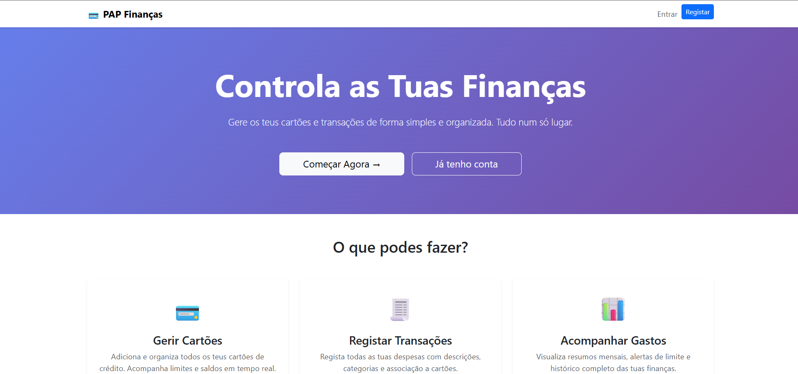
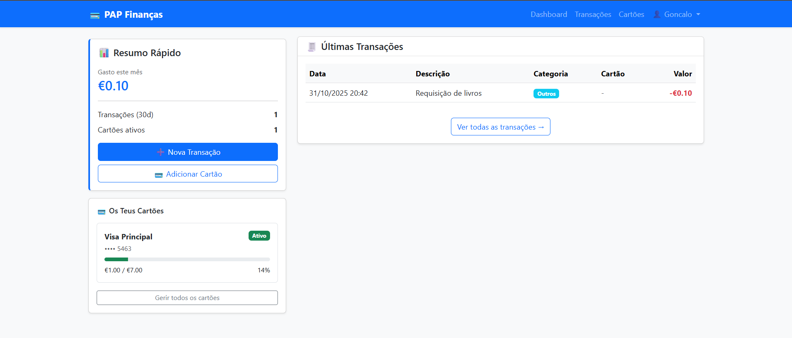
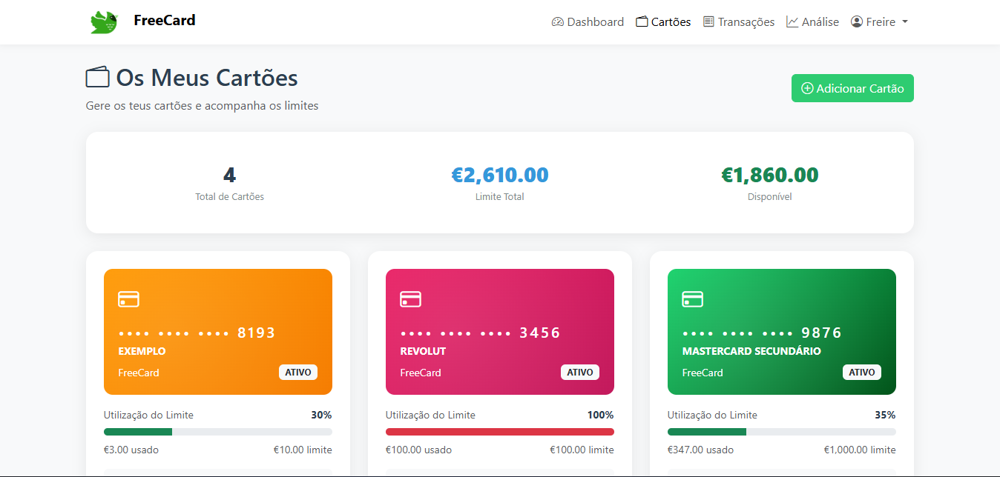
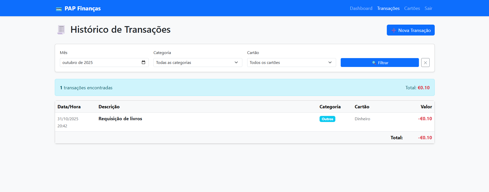

# 💳 PAP Finanças

Sistema de gestão de cartões de crédito e transações pessoais desenvolvido em PHP/MySQL como Projeto de Aptidão Profissional.

## 📋 Funcionalidades

- ✅ Sistema completo de autenticação (Login/Registo/Logout)
- 💳 Gestão de cartões de crédito
  - Adicionar, editar, ativar/desativar e eliminar cartões
  - Acompanhamento de limites e saldos
  - Alertas automáticos quando perto do limite (>80%)
- 🧾 Gestão de transações
  - Registar despesas com descrição e categoria
  - Associar transações a cartões específicos
  - Filtrar por mês, categoria e cartão
- 📊 Dashboard intuitivo
  - Resumo mensal de gastos
  - Visualização de cartões e limites
  - Últimas transações
  - Sistema de alertas

## 🚀 Tecnologias

- **Backend:** PHP 8+ com PDO
- **Base de Dados:** MySQL/MariaDB
- **Frontend:** Bootstrap 5
- **Servidor:** PHP Built-in Server (desenvolvimento)

## 📦 Instalação

### 1. Clonar o Repositório
```bash
git clone https://github.com/diogofreire-dev/Projeto-PAP2.git
cd Projeto-PAP2
```

### 2. Configurar Base de Dados

Cria a base de dados executando o schema:
```bash
mysql -u root -p < database/schema.sql
```

### 3. Configurar Ligação à BD

Copia o ficheiro de exemplo e edita com as tuas credenciais:
```bash
cp config/db.example.php config/db.php
```

Edita `config/db.php`:
```php
return [
    'host' => '127.0.0.1',
    'name' => 'pap',
    'user' => 'teu_utilizador',
    'pass' => 'tua_password',
    'charset' => 'utf8mb4',
];
```

### 4. Iniciar Servidor

```bash
php -S localhost:8000 -t site
```

Acede a: http://localhost:8000

## 📁 Estrutura do Projeto

```
Projeto-PAP2/
├── config/
│   ├── db.php              # Ligação à BD (não incluído no Git)
│   └── db.example.php      # Template de configuração
├── database/
│   └── schema.sql          # Schema da base de dados
├── site/
│   ├── index.php           # Homepage
│   ├── auth.php            # Middleware de autenticação
│   ├── register.php        # Registo de utilizadores
│   ├── login.php           # Login
│   ├── logout.php          # Logout
│   ├── dashboard.php       # Dashboard principal
│   ├── add_card.php        # Adicionar cartão
│   ├── cards.php           # Gerir cartões
│   ├── create_transaction.php  # Criar transação
│   └── transactions.php    # Histórico de transações
├── .gitignore
├── LICENSE
└── README.md
```

## 🔒 Segurança

- Passwords com hash usando `password_hash()` (bcrypt)
- Prepared statements (PDO) para prevenir SQL Injection
- Proteção CSRF através de sessions
- Validação server-side de todos os inputs
- Configurações sensíveis fora do controlo de versão

## 🎨 Capturas de Ecrã

### Homepage


### Dashboard


### Gestão de Cartões


### Transações


## 📝 Base de Dados

### Tabelas

**users**
- `id` - Identificador único
- `username` - Nome de utilizador (único)
- `email` - Email (único)
- `password_hash` - Password encriptada
- `role` - Papel (user/admin)
- `created_at` - Data de registo

**cards**
- `id` - Identificador único
- `user_id` - Referência ao utilizador
- `name` - Nome do cartão
- `last4` - Últimos 4 dígitos
- `limit_amount` - Limite do cartão
- `balance` - Saldo atual/gasto
- `active` - Estado (ativo/inativo)
- `created_at` - Data de criação

**transactions**
- `id` - Identificador único
- `user_id` - Referência ao utilizador
- `card_id` - Referência ao cartão (opcional)
- `amount` - Valor da transação
- `description` - Descrição
- `category` - Categoria
- `created_at` - Data/hora da transação

## 🛠️ Desenvolvimento

### Requisitos
- PHP 8.0 ou superior
- MySQL 5.7+ ou MariaDB 10.3+
- Extensão PDO MySQL habilitada

### Configuração para Desenvolvimento
```bash
# Instalar dependências (se necessário)
composer install

# Iniciar servidor de desenvolvimento
php -S localhost:8000 -t site
```

## 🤝 Contribuir

Contribuições são bem-vindas! Sente-te à vontade para:
1. Fazer fork do projeto
2. Criar uma branch (`git checkout -b feature/nova-funcionalidade`)
3. Commit das alterações (`git commit -m 'Adiciona nova funcionalidade'`)
4. Push para a branch (`git push origin feature/nova-funcionalidade`)
5. Abrir um Pull Request

## 📄 Licença

Este projeto está sob a licença MIT - vê o ficheiro [LICENSE](LICENSE) para mais detalhes.

## 👤 Autor

**Diogo Freire**
- GitHub: [@diogofreire-dev](https://github.com/diogofreire-dev)

## 📞 Suporte

Se encontrares algum problema ou tiveres sugestões, por favor abre uma [issue](https://github.com/diogofreire-dev/Projeto-PAP2/issues).

---

Desenvolvido com ❤️ como Projeto de Aptidão Profissional