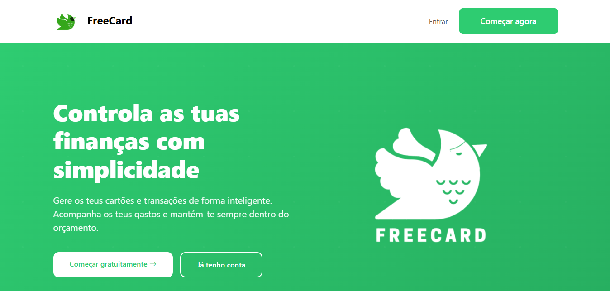
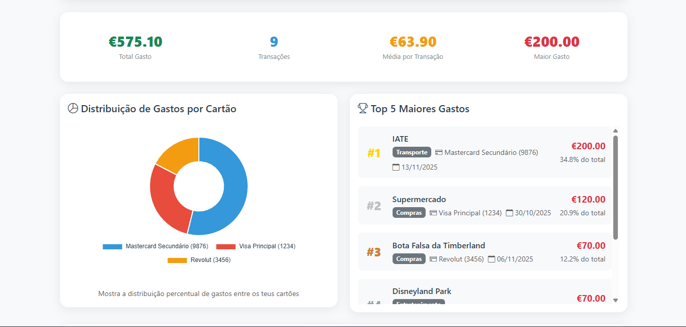

# FreeCard
Sistema completo de gestão de cartões de crédito e transações pessoais desenvolvido em PHP/MySQL como Projeto de Aptidão Profissional.

## Funcionalidades

### Autenticação e Segurança
- Sistema completo de autenticação (Login/Registo/Logout)
- Passwords encriptadas com bcrypt
- Prepared statements (PDO) para prevenir SQL Injection
- Proteção CSRF através de sessions
- Validação server-side de todos os inputs

### Gestão de Cartões
- Adicionar, editar, ativar/desativar e eliminar cartões
- Escolha de 8 cores diferentes para personalização
- Acompanhamento de limites e saldos em tempo real
- Alertas automáticos quando perto do limite (>80%)
- Pré-visualização ao vivo ao criar/editar cartões
- Estatísticas por cartão (total gasto, número de transações)

### Gestão de Transações
- Registar despesas com descrição, valor e categoria
- 8 categorias pré-definidas (Compras, Alimentação, Transporte, Saúde, Entretenimento, Educação, Casa, Outros)
- Associar transações a cartões específicos ou dinheiro
- Editar e eliminar transações
- Atualização automática dos saldos dos cartões
- Filtrar por mês, categoria e cartão

### Dashboard Intuitivo
- Resumo mensal de gastos com tendência vs. mês anterior
- Visualização de cartões e limites
- Últimas transações
- Categoria top do mês
- Maior despesa do mês
- Sistema de alertas para limites dos cartões
- Gráficos de gastos por categoria

### Análise e Relatórios
- Gráfico de evolução mensal por categoria
- Gráfico de barras de total por categoria
- Gráfico de pizza de distribuição por cartão
- Top 5 maiores gastos
- Estatísticas detalhadas (total gasto, média, número de transações)
- Filtros por ano e cartão

### Personalização
- **Tema Claro/Escuro**: Sistema completo de temas com transições suaves
- Notificações configuráveis
- Interface totalmente responsiva

## Tecnologias

- **Backend:** PHP 8+ com PDO
- **Base de Dados:** MySQL/MariaDB
- **Frontend:** Bootstrap 5, Bootstrap Icons
- **Servidor:** PHP Built-in Server (desenvolvimento)

## Instalação

### 1. Clonar o Repositório
```bash
git clone https://github.com/diogofreire-dev/FreeCard.git
cd FreeCard
```

### 2. Configurar Base de Dados

Cria a base de dados executando o schema:
```bash
mysql -u root -p < database/schema.sql
```

Ou importa manualmente através do phpMyAdmin/Adminer.

### 3. Configurar Ligação à BD

Copia o ficheiro de exemplo e edita com as tuas credenciais:
```bash
cp config/db.example.php config/db.php
```

Edita `config/db.php`:
```php
<?php
return [
    'host' => '127.0.0.1',
    'name' => 'pap',
    'user' => 'teu_utilizador',
    'pass' => 'tua_password',
    'charset' => 'utf8mb4',
];
```

### 4. Iniciar Servidor

```bash
php -S localhost:8000 -t site
```

Acede a: http://localhost:8000

## Estrutura do Projeto

```
FreeCard/
├── config/
│   ├── db.php              # Ligação à BD (não incluído no Git)
│   └── db.example.php      # Template de configuração
├── database/
│   └── schema.sql          # Schema completo da base de dados
├── site/
│   ├── assets/             # Imagens e recursos
│   │   ├── logo.png
│   │   └── logo2.png
│   ├── css/
│   │   ├── theme.css       # Sistema de temas claro/escuro
│   │   └── global-theme.css
│   ├── index.php           # Homepage
│   ├── auth.php            # Middleware de autenticação
│   ├── theme_helper.php    # Helper para gestão de temas
│   ├── register.php        # Registo de utilizadores
│   ├── login.php           # Login
│   ├── logout.php          # Logout
│   ├── dashboard.php       # Dashboard principal
│   ├── cards.php           # Listagem de cartões
│   ├── add_card.php        # Adicionar cartão
│   ├── edit_card.php       # Editar cartão
│   ├── transactions.php    # Listagem de transações
│   ├── create_transaction.php  # Criar transação
│   ├── edit_transaction.php    # Editar transação
│   ├── analytics.php       # Página de análise e gráficos
│   └── settings.php        # Configurações do utilizador
├── .gitignore
├── LICENSE
└── README.md
```

## Base de Dados

### Tabelas Principais

**users**
- `id` - Identificador único (INT)
- `username` - Nome de utilizador (VARCHAR, único)
- `email` - Email (VARCHAR, único)
- `password_hash` - Password encriptada (VARCHAR)
- `role` - Papel do utilizador (ENUM: user/admin)
- `created_at` - Data de registo (DATETIME)

**cards**
- `id` - Identificador único (INT)
- `user_id` - Referência ao utilizador (INT)
- `name` - Nome do cartão (VARCHAR)
- `last4` - Últimos 4 dígitos (CHAR)
- `limit_amount` - Limite do cartão (DECIMAL)
- `balance` - Saldo atual/gasto acumulado (DECIMAL)
- `color` - Cor do cartão (VARCHAR) - 8 opções disponíveis
- `active` - Estado ativo/inativo (TINYINT)
- `created_at` - Data de criação (DATETIME)

**transactions**
- `id` - Identificador único (INT)
- `user_id` - Referência ao utilizador (INT)
- `card_id` - Referência ao cartão (INT, opcional)
- `amount` - Valor da transação (DECIMAL)
- `description` - Descrição (VARCHAR)
- `category` - Categoria (VARCHAR) - 8 categorias disponíveis
- `created_at` - Data/hora da transação (DATETIME)

**user_settings**
- `id` - Identificador único (INT)
- `user_id` - Referência ao utilizador (INT, único)
- `theme` - Tema da interface (VARCHAR: light/dark)
- `currency` - Moeda (VARCHAR, default: EUR)
- `language` - Idioma (VARCHAR, default: pt-PT)
- `notifications` - Notificações ativas (TINYINT)
- `created_at` - Data de criação (DATETIME)
- `updated_at` - Última atualização (DATETIME)

### Relacionamentos

- Um utilizador pode ter múltiplos cartões (1:N)
- Um utilizador pode ter múltiplas transações (1:N)
- Uma transação pode estar associada a um cartão ou ser paga em dinheiro (N:1 opcional)
- Um utilizador tem uma configuração de settings (1:1)

## Funcionalidades de UI/UX

### Sistema de Temas
- **Tema Claro**: Interface limpa e moderna com cores claras
- **Tema Escuro**: Interface elegante com fundo escuro para reduzir fadiga visual
- Transições suaves entre temas
- Persistência da escolha do tema por utilizador

### Categorias de Transações
8 categorias com ícones intuitivos:
- Compras
- Alimentação
- Transporte
- Saúde
- Entretenimento
- Educação
- Casa
- Outros

### Responsividade
- Design totalmente responsivo
- Funciona perfeitamente em desktop, tablet e mobile
- Grid system adaptativo do Bootstrap 5

## Gráficos e Análises

### Chart.js Implementation
- **Gráfico de Linhas**: Evolução mensal de gastos por categoria
- **Gráfico de Pizza**: Distribuição de gastos por cartão
- **Gráfico de Barras**: Total gasto por categoria
- Interatividade com tooltips informativos
- Suporte para tema claro e escuro

## Segurança

### Medidas Implementadas
- **Passwords**: Hash usando `password_hash()` com bcrypt
- **SQL Injection**: Prepared statements em todas as queries
- **Session Security**: Regeneração de session ID após login
- **CSRF Protection**: Validação de origem das requisições
- **XSS Prevention**: Uso de `htmlspecialchars()` em todas as saídas
- **Input Validation**: Validação server-side rigorosa
- **Sensitive Data**: Configurações fora do controlo de versão (.gitignore)

## Capturas de Ecrã

### Homepage

*Landing page com apresentação das funcionalidades*

### Dashboard

*Dashboard principal com resumo de gastos e cartões*

### Gestão de Cartões

*Interface de gestão de cartões com visualização de limites*

### Transações

*Listagem completa de transações com filtros*

### Análise

*Página de análise com gráficos interativos*

## Desenvolvimento

### Requisitos
- PHP 8.0 ou superior
- MySQL 5.7+ ou MariaDB 10.3+
- Extensão PDO MySQL habilitada
- Extensão JSON habilitada

### Configuração para Desenvolvimento
```bash
# Iniciar servidor de desenvolvimento
php -S localhost:8000 -t site

# Ou com porta personalizada
php -S localhost:3000 -t site
```

### Estrutura de Dados de Exemplo
O ficheiro `schema.sql` já inclui:
- Estrutura completa de todas as tabelas
- Exemplos de cartões (comentados)
- Exemplos de transações (comentados)
- Queries úteis para dashboard

## Funcionalidades Futuras (Roadmap)

- [ ] Exportação de relatórios em PDF
- [ ] Definição de metas de gastos mensais
- [ ] Notificações por email
- [ ] Importação de transações via CSV
- [ ] Gestão de múltiplas moedas
- [ ] Dashboard com mais gráficos (comparações anuais)
- [ ] Sistema de tags para transações
- [ ] Previsões de gastos baseadas no histórico
- [ ] API REST para integrações externas

## Contribuir

Contribuições são bem-vindas! Sente-te à vontade para:

1. Fazer fork do projeto
2. Criar uma branch (`git checkout -b feature/nova-funcionalidade`)
3. Commit das alterações (`git commit -m 'Adiciona nova funcionalidade'`)
4. Push para a branch (`git push origin feature/nova-funcionalidade`)
5. Abrir um Pull Request

### Guidelines para Contribuições
- Segue o estilo de código existente
- Testa todas as funcionalidades antes de submeter
- Documenta novas funcionalidades
- Atualiza o README se necessário

## Changelog

### Versão 1.0.0 (Janeiro 2025)
- Sistema completo de autenticação
- Gestão de cartões com 8 cores personalizáveis
- Gestão de transações com 8 categorias
- Dashboard interativo com estatísticas
- Página de análise com 3 tipos de gráficos
- Sistema de temas claro/escuro
- Interface totalmente responsiva
- Sistema de alertas para limites de cartões
- Filtros avançados de transações
- Configurações de utilizador

## Licença

Este projeto está sob a licença MIT - vê o ficheiro [LICENSE](LICENSE) para mais detalhes.

## Autores

**Diogo Freire** - Desenvolvimento Principal
- GitHub: [@diogofreire-dev](https://github.com/diogofreire-dev)

**Jandro Antunes** - Colaborador
- Projeto de Aptidão Profissional

## Suporte

Se encontrares algum problema ou tiveres sugestões:
- Abre uma [issue](https://github.com/diogofreire-dev/FreeCard/issues) no GitHub
- Contacta através do GitHub

## Agradecimentos

- Bootstrap 5 pela framework CSS
- Bootstrap Icons pelo conjunto de ícones
- Chart.js pela biblioteca de gráficos
- Comunidade PHP pela documentação e recursos

---

**Desenvolvido como Projeto de Aptidão Profissional**

*FreeCard - Gestão financeira simples, rápida e gratuita*